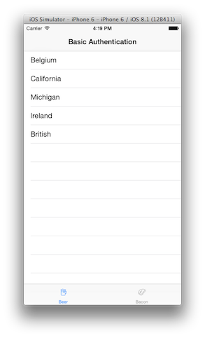
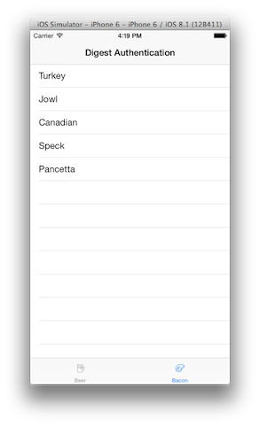

Authentication
=======
Level: Beginner  
Technologies: Swift, iOS  
Summary: A basic example of performing http basic/digest authentication using aerogear-ios-http

What is it?
-----------

This project is a very simple app, to show how to perform an HTTP Basic/Digest authentication against a simple REST endpoint. The demo is implemented in [Swift](https://developer.apple.com/swift/) and uses the [aerogear-ios-http](https://github.com/aerogear/aerogear-ios-http) library. Backend REST endpoint is implemented in this [repo](https://github.com/aerogear/aerogear-backend-cookbook/tree/master/Authentication). For convenience an [OpenShift instance](http://igtests-cvasilak.rhcloud.com/rest/team/developers) has been deployed and the demo has been preconfigured to use it. Please make sure it is not idle before running the app, by hitting the URL in your browser. 

System requirements
-------------------
- iOS 8.X
- Xcode6.1.1 and later

Configure
---------
Either run a [backend instance locally](https://github.com/aerogear/aerogear-backend-cookbook/tree/master/Authentication) or use the [OpenShift instance](http://igtests-cvasilak.rhcloud.com/) . To verify that the server is indeed running, [click here](https://igtests-cvasilak.rhcloud.com/rest/grocery/beers) (user: ```john``` pass:```123```) for the HTTP Basic protected endpoint, or [click here](https://igtests-cvasilak.rhcloud.com/rest/grocery/bacons) (user: ```agnes``` pass: ```123```) for the HTTP Digest authentication endpoint.


Build and Deploy
------------------------

### Change URL

If you deploy the backend locally, in Network.swift, update the URL accordingly:

```swift
    static let instance = Http(baseURL: "http://localhost:8080/authentication")
...
}
```

### Run it in Xcode

To run it, just hit the run button on Xcode.

The source code of [aerogear-ios-http](https://github.com/aerogear/aerogear-ios-http) library is contained in ../libs/AeroGearHttp shared folder.

> **NOTE:** Hopefully in the future and as the Swift language and tools around it mature, more straightforward distribution mechanisms will be employed using e.g [cocoapods](http://cocoapods.org) and framework builds. Currently neither cocoapods nor binary framework builds support Swift. For more information, consult this [mail thread](http://aerogear-dev.1069024.n5.nabble.com/aerogear-dev-Swift-Frameworks-Static-libs-and-Cocoapods-td8456.html) that describes the current situation.

Application Flow
----------------
When the application is launched, you will presented with two tabs in which the former fetches data after performing HTTP basic and the latter after performing HTTP digest.

     
