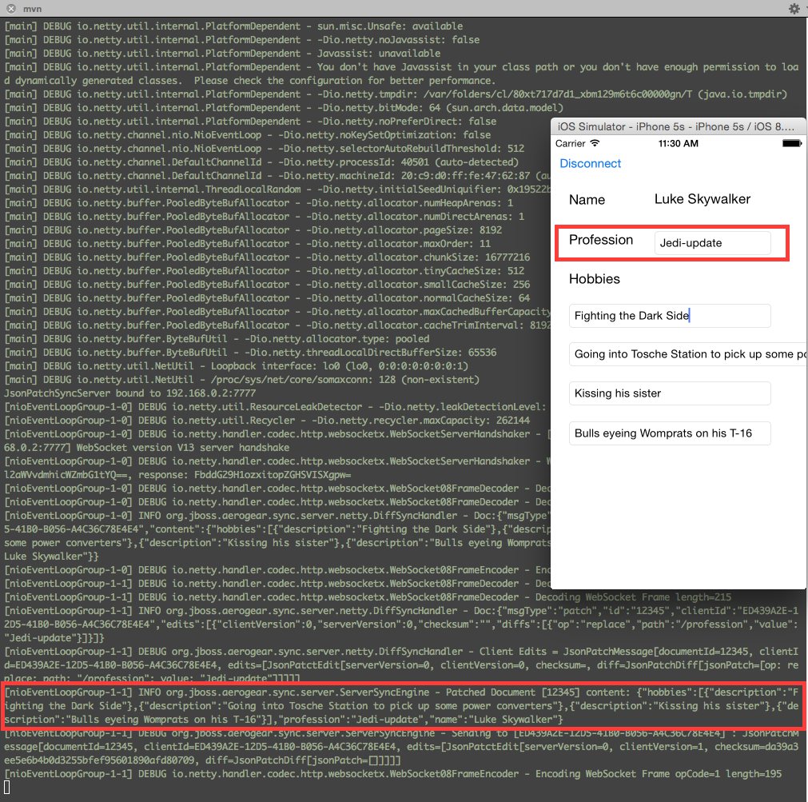

Jedi
====
Level: Beginner  
Technologies: Swift, iOS  
Summary: A basic example of [aerogear-ios-sync](https://github.com/aerogear/aerogear-ios-sync), [aerogear-ios-sync-client](https://github.com/aerogear/aerogear-ios-sync-client)  

What is it?
-----------
This project is a simple demo for the work around [AeroGear Differential Synchronization](https://github.com/aerogear/aerogear-sync-server).

There are two versions of the demo, ```JsonPatchSync``` to run the sync demo using [JsonPatch](https://tools.ietf.org/html/rfc6902) protocol or ```DiffMatchPatchSync``` that uses DiffMatchPatch [Google initial implementation](https://github.com/JanX2/google-diff-match-patch).

Both demos uses the [iOS SyncClient](https://github.com/aerogear/aerogear-ios-sync-client) which handles the communication with the sync server. 
The [iOS SyncEngine](https://github.com/aerogear/aerogear-ios-sync) performs the actual work of the DiffSync protocol for the SyncClient.

System requirements
-------------------
- iOS 8.X
- Xcode version 6.1.1

Configure
---------

This project requires that the [AeroGear Differential Synchronization Server](https://github.com/aerogear/aerogear-sync-server/tree/master/server/server-netty) be running. Please refer to that project for instructions for starting the server.

To run on actual device, select the version you want to use,  modify ```<Demo>/AeroGearSyncDemo/Info.plist``` and change the SyncServerHost to match your IP address and make sure it matches the one on [AeroGear Differential Synchronization Server](https://github.com/aerogear/aerogear-sync-server/tree/master/server/server-netty).

Build and Deploy Jedi
---------------------

### Run it in Xcode

The project uses [cocoapods](http://cocoapods.org) 0.36.0 pre-release for handling its dependencies. As a pre-requisite, install [cocoapods pre-release](http://blog.cocoapods.org/Pod-Authors-Guide-to-CocoaPods-Frameworks/) and then install the pod. 

Choose the variant of the demo you want to use, enter the directory and run:

```bash
pod install
```

and then double click on the generated .xcworkspace to open in Xcode.

Application Flow
----------------

To test the application, you will need two Jedi demos running. For exemple:
- launch the application on your device
- launch the application on you simulator
- modify one field on simulator and see it instantly synchronized on device!



