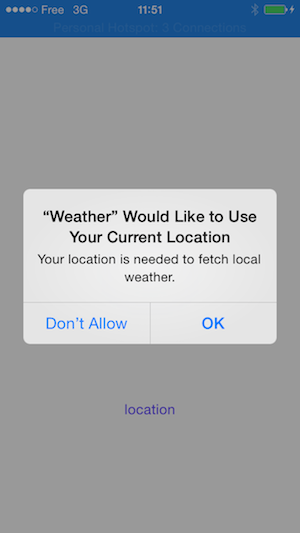
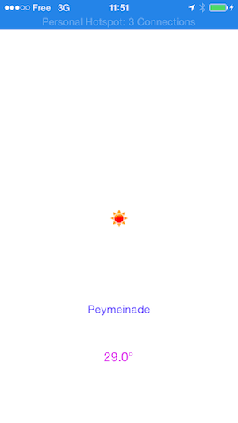

Weather
=======
Level: Beginner  
Technologies: Swift 3.0, iOS
Summary: A basic example of aerogear-ios-http  

What is it?
-----------

This project is a very simple app, to show how to do a http call against a simple REST endpoint. The demo is implemented in [Swift](https://developer.apple.com/swift/) and uses the [aerogear-ios-http](https://github.com/aerogear/aerogear-ios-http) library. 

System requirements
-------------------
- iOS8, iOS9, iOS10
- Xcode8

Configure
---------
Nothing to be done. 
The app fetches data from http://api.openweathermap.org/data/2.5/weather

Build and Deploy Buddies
------------------------

### Run it in Xcode

The project uses [CocoaPods](http://cocoapods.org) for handling its dependencies. As a pre-requisite, install [CocoaPods](http://cocoapods.org) and then install the pod. On the root directory of the project run:

```bash
pod install
```

and then double click on the generated .xcworkspace to open in Xcode.

Application Flow
----------------

When the application is launched for the first time, it will prompt you to accept to share your current location



Once you've accepted, it will display weather forecast in your area:


